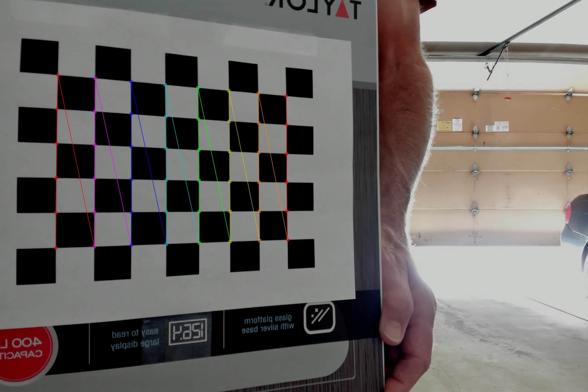

# SpeedCam: Real-Time Vehicle Speed Detection System

## Overview

SpeedCam is an advanced vehicle speed detection system that utilizes computer vision and machine learning techniques to accurately measure and record vehicle speeds in real-time. This system is designed for traffic monitoring, law enforcement, and road safety applications. AI wrote more than 90% of the code in this project. 

## How It Works

1. **Object Detection**: The system uses a YOLO-based object detection algorithm to identify vehicles in real-time video streams.

2. **Speed Estimation**: Once vehicles are detected, their speed is estimated using Farneback optical flow. This estimation process runs in a separate thread to ensure that real-time processing is not impacted.

3. **Calibration**: The system requires both camera calibration (dewapring of the captured image) and speed calibration (pixel to world speed conversion) to accurately convert pixel movements to real-world speeds.

4. **User Interface**: A web-based frontend allows users to monitor detections, manage calibrations, and control the detection process.

## Key Features

- Real-time vehicle detection and speed estimation
- Separate processing threads for detection and estimation
- Camera calibration for lens distortion correction
- Speed calibration for accurate speed measurements
- Web-based user interface for easy monitoring and control

## System Requirements

- Macbook Pro M Series (for MLX and GPU capabilities)
- Python 3.11 or higher
- Node.js

## Installation

1. Install Homebrew (for macOS users):
   ```
   /bin/bash -c "$(curl -fsSL https://raw.githubusercontent.com/Homebrew/install/HEAD/install.sh)"
   ```

2. Install Python 3.11 or higher:
   ```
   brew install python@3.11
   ```

3. Install Node.js:
   ```
   brew install node
   ```

4. Clone the repository:
   ```
   git clone https://github.com/your-repo/speedcam.git
   cd speedcam
   ```

5. Start the application:
   ```
   npm run dev
   ```
   This command will:
   - Create a Python virtual environment
   - Install Python requirements
   - Start the backend server
   - Start the frontend development server

6. Navigate to http://localhost:3000 (or whatever port was used.)

## Setup and Usage

### 1. Camera Calibration

Before using the system, you need to create a camera calibration:

1. Click "Add Calibration" in the Camera Calibrations panel. 
2. Enter a camera name for this camera calibration. 
3. Enter the row and column count of the grid image you will be using. For the sample provided in the image located in [Checkerboard](images/Checkerboard-A4-25mm-8x6.pdf), rows is 6 and columns is 8.
3. Adding Calibration Images:    
    - Via Live Camera Source:
        1. Select the camera source.
        3. Enter the row and column count of the grid image you will be using. 
        4. Hold up the grid image at various angles in front of the camera. 
        5. Hit the capture button to capture a new calibration image. Capture at least 8 images of a checkerboard grid pattern from different angles.
    - Via Uploaded Images:
        1. Click on "Switch to Upload" 
        2. Click on "Upload Images" and select your calibration images from your disk. 
4. As you upload images, these images will appear grayed out with an X if processing fails, and will show a checkmark if they are valid. If an image fails processing, the likely issues are:
    - The grid is not fully visible in the frame. 
    - The grid is too far away from the camera. It should take up at least 60% of the visible area.
    - The number of rows and columns selected does not match the grid used.
    - The image lighting is not bright enough. Turn on an overhead light, or wait for a clear sky day.
5. Once you have uploaded enough valid images, press save calibration. Your images will be processed a final time and the calibration will be ready for use.

An example of a valid calibration image with rows = 6 and columns = 8, with detected corners marked:



### 2. Speed Calibration

After camera calibration, you need to create a speed calibration:

1. Click Add Calibration in the Speed Calibration panel. 
2. Enter a new name for this calibration. 
3. Select the associated camera calibration
4. Adding Detections: 
    - Via Live Camera Source:
        1. Select the input camera source you wish to use from the select camera option. 
        2. When ready, click start calibration. A camera feed will be captured and vehicles detected. 
        3. When the desired vehicles you're interested in are detected with known speeds, hit stop calibration. 
    - Via Recorded Videos:
        1. Upload a video via the choose file selector. Video processing will begin automatically. 
5. For each detected vehicle, either enter a known speed or delete the vehicle. You must have at least two vehicles for each direction in order for the calibration to be accepted.
6. Once you are satisfied, hit Submit Calibration. The system will process the video and calculate the necessary constants to convert pixel movement to real-world speeds.

### 3. Running the Detector

Once calibrations are complete, you can start detecting vehicle speeds:

1. Navigate to the top of the frontend UI.
2. Use the status selector to choose your camera input and speed calibration.
3. Optionally define a speed limit in your unit of speed which is used to compute the high level statistics. Hit enter to submit a new speed limit.
3. Click "Start Detector" to begin real-time speed detection.

### 4. Monitoring and Using Results

Once the detector is running, you can monitor and analyze the results in real-time:

1. **Live Detection Feed**: At the top of the UI, you'll see a live image feed showing the current detections. This allows you to visually confirm that the system is working correctly.

2. **Detection Statistics**: Below the live feed, you'll find a summary of detection statistics for the last seven days:
   - Total number of vehicles detected
   - Average speed of detected vehicles
   - Number of speeding violations (based on the currently selected speed limit)

3. **Speed Graph**: The speed graph displays detected speeds for the last seven days, providing a quick overview of speed trends and patterns.

4. **Detection Table**: Further down, you'll find a scrollable table showing individual detections. Each row in the table represents a single vehicle detection, including details such as timestamp, detected speed, and lane information.

5. **Data Export**: The detection table includes an export feature that allows you to download your detection data:
   - Click the "Export" button to save the detection data as a CSV file.
   - You have the option to include images of each detection in the export.

6. **Custom Filters**: In the vehicle chart section, you can customize the filters to view historical results for any desired time range:
   - Click on the "Filters" option in the vehicle chart section.
   - Set your preferred time range and any other relevant filters.
   - The chart and detection table will update to show results based on your selected filters.

This comprehensive view allows you to monitor real-time detections, analyze speed trends over time, export detailed data, and customize your view of historical data for in-depth analysis or reporting.

## Contributing

Feel free to contribute to this project by submitting pull requests or opening issues or by forking the code and using it for your own purposes. Just remember to reference this project in your code. Responses are not guaranteed. This is not a production ready project, and is meant only for educational purposes. 

## License

This project is licensed under the Apache License 2.0 - see the [LICENSE](LICENSE) file for details.
